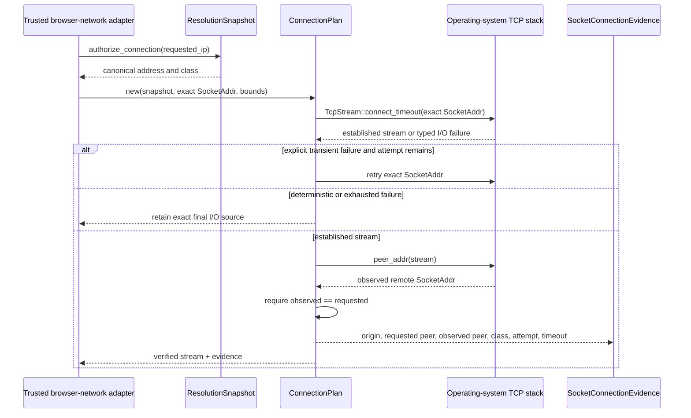

# ADR 0005: Bind approved destinations to exact TCP peers

- **Status:** Accepted
- **Date:** 2026-08-06
- **Decision owners:** Contextual Wisdom Lab

## Context

ADR 0004 separates logical web-origin authority from resolver-supplied network destinations. The `originweave-destination` crate classifies addresses, binds a bounded DNS answer to one `Origin`, and authorizes a concrete canonical IP address. It intentionally performs no socket I/O.

That policy decision alone does not prove that the operating system connected to the approved destination. A later adapter could resolve a hostname again, inherit proxy or PAC behavior, substitute another address, or expose a stream before checking its actual remote peer. OriginWeave therefore cannot claim a safe transport boundary merely because a `ResolutionSnapshot` approved an IP address.

A bounded attempt count is not sufficient retry policy. Repeating the same exact `connect_timeout` call after deterministic local failures such as `PermissionDenied`, `InvalidInput`, or `AddrNotAvailable` cannot change their cause. Retrying those failures wastes the bounded latency budget and obscures the first actionable operating-system error. Retrying every future `io::ErrorKind` by default would also silently expand behavior when Rust adds or reclassifies errors.

## Decision

Create an independently reusable `originweave-network` Rust crate with a **direct-only** synchronous TCP boundary.

A caller supplies:

- an existing `ResolutionSnapshot`;
- one explicit canonical `SocketAddr`;
- a timeout in `1ns..=30s`;
- an attempt count in `1..=4`.

`ConnectionPlan::new` rejects port zero, invalid bounds, addresses absent from the snapshot, and IPv4-mapped IPv6 or any other form that differs from the snapshot's canonical address. The plan is non-cloneable and is consumed by `connect`, preventing accidental replay of the same authority.

The production path calls `TcpStream::connect_timeout` with that exact `SocketAddr`; it never accepts a hostname and never resolves again. After the operating system establishes the stream, the crate calls `peer_addr`. The stream is exposed only when the observed peer matches the requested IP and port exactly.

Connection retries use an explicit conservative allow-list. Only `TimedOut`, `ConnectionRefused`, `ConnectionReset`, `ConnectionAborted`, and `Interrupted` may consume another attempt while capacity remains. Every other connection error fails on the current attempt and retains that exact `io::Error` as its source. Peer-inspection failures and peer mismatches remain non-retrying because another connection cannot repair ambiguous or substituted peer evidence.

The crate emits credential-free evidence containing only the logical origin, requested socket, observed peer, destination class, successful attempt number, and per-attempt timeout. Standard errors retain an underlying destination-policy or I/O error as `source()` where appropriate.

## Security boundary

The direct-only crate does **not**:

- resolve DNS names;
- inspect or inherit proxy environment variables;
- execute proxy or PAC rules;
- perform TLS certificate, server-name, or ALPN validation;
- parse HTTP;
- implement connection pooling;
- control Chromium, WebDriver BiDi, CDP, or WebMCP.

TLS identity, proxy routing, HTTP resource budgets, and the Chromium socket adapter remain separate authority boundaries. A future proxy path must separately approve both the proxy and the final target and must not silently replace this direct-only decision.

## Consequences

### Positive

- The exact operating-system peer becomes testable evidence rather than an adapter assumption.
- No hostname-based API can reintroduce DNS between policy approval and socket use.
- IPv4-mapped IPv6 cannot bypass canonical destination authority.
- Timeout and attempt bounds constrain one synchronous direct connection plan.
- Deterministic local failures stop after one attempt and preserve their first actionable source.
- New or unreviewed `io::ErrorKind` variants fail closed instead of silently entering the retry set.
- The crate can be embedded independently, in OriginWeave, in naruon, or in another CWL service.

### Negative

- The first implementation is synchronous and does not provide an async runtime adapter.
- Direct-only routing does not satisfy deployments that require an enterprise proxy.
- Exact TCP peer proof does not prove TLS server identity or HTTP safety.
- Retried transient failures use no backoff; backoff and total elapsed-time budgets belong to a higher-level transport policy.
- Callers must not interpret the attempt count as a circuit-breaker or end-to-end deadline contract.
- Operating-system error semantics can vary by platform, so adding another retryable kind requires explicit cross-platform evidence and regression tests.

## Alternatives rejected

### Accept a hostname and call `TcpStream::connect`

Rejected because hostname-based connection APIs may resolve internally, obscuring the address used and reopening a time-of-check/time-of-use gap.

### Trust successful connection creation without checking `peer_addr`

Rejected because the product would have no independent proof that the stream's remote socket matches the approved address and port.

### Retry every connection error until the attempt count is exhausted

Rejected because deterministic local permission, input, and address failures cannot be repaired by the same immediate call, while an open-ended rule would make future error variants retryable without review.

### Never retry inside the crate

Rejected because bounded transient failures such as timeout, refusal, reset, abort, or interruption can recover on a subsequent exact-address attempt, and callers would otherwise duplicate retry classification while losing the single-use plan's bounded evidence.

### Inherit proxy settings automatically

Rejected because a proxy introduces another destination and authority chain. Ambient configuration must not bypass destination policy.

### Put TLS, HTTP, and Chromium integration in the same crate

Rejected because those are independently changing and independently reviewable trust boundaries. Combining them would weaken modular reuse and make security evidence ambiguous.

## Verification

The merge gate requires:

- a real loopback `TcpListener`/`TcpStream` integration test;
- canonical-address, port, timeout, attempt, and destination-policy boundary tests;
- behavioral tests proving every allow-listed transient error may retry within the bound;
- behavioral tests proving representative deterministic errors stop after one attempt and retain their exact source;
- deterministic connector tests for timeout, connection failure, peer-inspection failure, and peer mismatch;
- a compile-fail replay test for consumed plans;
- exact 100% production function, line, region, and branch coverage;
- complete public rustdoc;
- static contracts forbidding hostname resolution, ambient proxy access, and retry-by-default behavior;
- current-head CI, Security Scan, and Semgrep success.

## Standards

RFC 9293 defines the current Standards Track TCP specification and identifies a TCP connection by its pair of endpoint sockets. Rust 1.97.1 documents `TcpStream::connect_timeout` as a connection attempt to one supplied `SocketAddr`, `peer_addr` as the established stream's remote socket address, and `io::ErrorKind` as a non-exhaustive classification. OriginWeave uses those properties as the direct transport proof and explicit retry boundary while retaining separate TLS, HTTP, proxy, and Chromium decisions.

## References

Eddy, W. (Ed.). (2022). *Transmission Control Protocol (TCP)* (RFC 9293). RFC Editor. https://doi.org/10.17487/RFC9293 · https://www.rfc-editor.org/rfc/rfc9293
