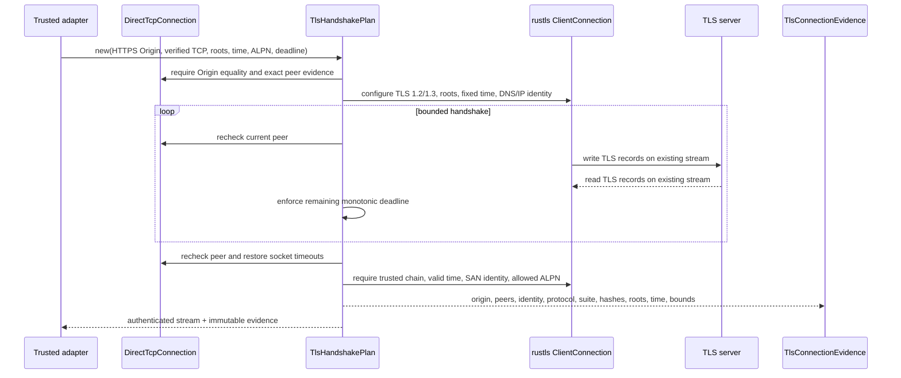

# ADR 0006: Bind TLS service identity to the verified TCP peer

- **Status:** Accepted
- **Date:** 2026-08-07
- **Decision owners:** Contextual Wisdom Lab

## Context

ADR 0004 authorizes an origin-bound set of canonical destination addresses. ADR 0005 turns one of those addresses into an exact operating-system TCP peer and exposes the stream only after the requested and observed IP address and port match.

TCP peer equality is necessary transport evidence, but it does not authenticate the requested HTTPS service. A process at the approved address can present a certificate issued by an untrusted authority, a certificate outside its validity interval, a certificate for another DNS name or IP address, or an otherwise invalid chain. An adapter can also negotiate an application protocol that the caller did not authorize, silently assume HTTP/1.1 when no ALPN value was selected, reconnect through a different path, or disable certificate verification.

OriginWeave therefore needs a separate trust boundary that consumes the already verified stream and binds WebPKI service identity to the canonical `Origin`.

## Decision

Create an independently reusable `originweave-tls` Rust crate. The crate performs one client TLS handshake over an existing `DirectTcpConnection`; it never resolves a hostname, opens another socket, evaluates proxy or PAC configuration, parses HTTP, or controls Chromium.

A caller supplies:

- one canonical HTTPS `Origin`;
- one existing `DirectTcpConnection` and its immutable `SocketConnectionEvidence`;
- a non-empty, bounded, explicit trust-root bundle;
- a fixed trusted verification time;
- a total handshake timeout in `1ns..=30s`;
- an ordered, bounded ALPN allow-list;
- an explicit policy stating whether ALPN selection is required or optional.

The plan is single-use. `TlsHandshakePlan::authenticate` consumes the plan and the underlying direct TCP connection.

## Identity derivation

The reference identity is derived only from the canonical origin host.

- A DNS origin becomes a DNS `ServerName` and permits SNI.
- A literal IPv4 or IPv6 origin becomes an IP `ServerName` and sends no invented DNS SNI value.
- A loopback HTTP origin is valid for managed direct TCP testing but is rejected by the TLS authority before TLS bytes are emitted.
- The TLS origin must exactly equal the origin recorded in the direct TCP evidence.

WebPKI verification uses subject alternative names. DNS identity does not fall back to the certificate Common Name. Literal IP origins require an exact `iPAddress` subjectAltName.

## Protocol and cryptographic configuration

The reviewed implementation pins rustls 0.23.42 with the `ring`, `std`, and `tls12` features and disables default features. It permits TLS 1.2 and TLS 1.3 only.

Production configuration:

- loads only caller-supplied trust roots;
- uses an explicit fixed `TimeProvider`;
- disables session resumption;
- disables early data;
- disables secret extraction;
- installs `NoKeyLog`;
- offers only caller-approved ALPN identifiers;
- requires rustls to reject a selected ALPN value outside that offer;
- disables certificate compression and decompression in the first slice;
- uses no client certificate;
- exposes no dangerous custom verifier hook.

The first slice records revocation as `NotConfigured`. It does not claim OCSP or CRL validation when no revocation evidence was supplied.

## Stream binding and deadline

The same direct TCP stream is inspected before plan construction, before the handshake, during each handshake iteration, and after the handshake. At every point:

```text
requested TCP peer == previously observed TCP peer == current operating-system peer
```

The handshake uses a monotonic total deadline. Before each blocking read or write, the socket timeout is set to the remaining deadline. A timeout or `WouldBlock` condition is reported as a handshake timeout rather than retried beyond the total budget. On success, the original socket read and write timeouts are restored before the authenticated stream is exposed.



## Evidence

The crate emits credential-free immutable evidence containing:

- canonical HTTPS origin;
- requested and observed TCP peer;
- DNS or IP reference identity;
- TLS protocol version and two-byte cipher-suite identifier;
- selected allowed ALPN identifier or explicit absence;
- SHA-256 identifiers for the leaf certificate, leaf SubjectPublicKeyInfo, and every server-presented certificate;
- server-presented certificate count and encoded byte count;
- leaf `notBefore` and `notAfter` timestamps;
- trust-bundle policy identifier, canonical bundle hash, distinct root count, and encoded byte count;
- trusted verification time;
- explicit revocation status;
- measured handshake duration and configured deadline.

The certificate hashes describe the server-presented chain accepted by the completed WebPKI verification. They are not represented as a reconstructed certification path, because rustls does not expose the internal path as this crate's evidence contract.

## Bounds

The first slice enforces:

| Input or evidence | Maximum |
|---|---:|
| total TLS handshake timeout | 30 seconds |
| ALPN identifiers | 8 |
| one ALPN identifier | 255 bytes |
| total ALPN identifier bytes | 1,024 bytes |
| trust roots | 256 |
| trust-root DER input | 2 MiB |
| server-presented certificates | 16 |
| server-presented certificate DER | 1 MiB |

These are product safety limits, not claims about all valid PKIX deployments. A managed future version can revise them through a new ADR and compatibility policy.

## Error contract

Public errors implement deterministic `Display` and `std::error::Error`. Underlying rustls or operating-system failures remain available through `source()` without including certificate bodies, credentials, full URLs, or model input.

Typed failures distinguish:

- invalid trust-root, timeout, ALPN, and certificate bounds;
- non-HTTPS or invalid reference identity;
- TLS origin and TCP authority mismatch;
- inherited or live TCP peer mismatch;
- peer inspection and socket I/O failure;
- unknown issuer, expired certificate, not-yet-valid certificate, name mismatch, and other invalid certificate conditions;
- TLS protocol failure;
- missing or unsupported protocol and cipher evidence;
- missing, absent-required, or unexpected ALPN;
- missing, excessive, or malformed presented certificates;
- timeout restoration failure.

## Security boundary

The TLS crate does **not**:

- resolve DNS;
- connect or reconnect a socket;
- inherit proxy environment variables;
- authorize proxy or PAC routing;
- parse HTTP requests or responses;
- acquire or update operating-system trust roots;
- fetch OCSP responses or CRLs;
- accept client certificates;
- enable 0-RTT, key logging, secret extraction, or a dangerous custom verifier;
- control Chromium, WebDriver BiDi, CDP, WebMCP, or MCP.

HTTP authority, proxy routing, revocation distribution, Chromium Network Service integration, download policy, and connection pooling remain separately reviewable boundaries.

## Consequences

### Positive

- TLS identity is cryptographically bound to the same exact TCP stream already authorized by destination policy.
- DNS and IP literal identities follow distinct RFC 9525 reference-identity rules.
- Fixed verification time makes certificate-validity tests deterministic and supports reproducible evidence.
- Explicit roots prevent ambient host trust-store changes from silently changing one model run or audit record.
- Explicit ALPN prevents the adapter from inventing an application protocol after the handshake.
- Credential-free evidence supports incident response, replay analysis, and buyer-facing audit.
- The crate can be consumed by OriginWeave, naruon, or another CWL service without Chromium.

### Negative

- The first implementation is synchronous and applies socket read/write timeouts while the handshake owns the stream.
- The caller must construct and version the trust-root bundle.
- Revocation is explicitly not configured in the first slice.
- Certificate compression, resumption, 0-RTT, ECH, client authentication, and delegated credentials are unavailable.
- Server-presented certificate hashes do not expose rustls's internal reconstructed validation path.
- The crate authenticates a direct stream but does not prove that Chromium used it.

## Alternatives rejected

### Use the operating-system TLS stack implicitly

Rejected because trust roots, verification time, ALPN, evidence, and verifier behavior would become ambient and harder to reproduce across platforms.

### Trust the approved IP address as the HTTPS identity

Rejected because IP ownership and TCP reachability do not prove control of the requested DNS service identity.

### Disable verification for local or test environments

Rejected because a production bypass tends to escape its intended environment. Tests use an explicit managed loopback destination policy and an explicit test CA instead.

### Fall back from DNS SAN to Common Name

Rejected because RFC 9525 requires service identity to use applicable subject alternative names and deprecates Common Name fallback.

### Reconnect through a hostname-based TLS convenience API

Rejected because reconnecting would discard the exact destination and peer evidence established by ADRs 0004 and 0005.

### Combine TLS, HTTP, proxy, and Chromium integration

Rejected because each layer has separate authority, resource, evidence, and update lifecycles. Combining them would make failures and buyer evidence ambiguous.

## Verification

The merge gate requires:

- real loopback rustls client/server integration over `DirectTcpConnection`;
- trusted DNS SAN success;
- wrong-name and Common-Name-fallback rejection;
- untrusted-root rejection;
- expired and not-yet-valid rejection at a fixed trusted time;
- literal IPv4 and IPv6 SAN success;
- TLS 1.2 and TLS 1.3 negotiation tests;
- required and optional ALPN behavior;
- TLS-origin and TCP-authority equality tests;
- static prohibition of reconnect, DNS lookup, proxy inheritance, key logging, 0-RTT, client authentication, and dangerous verifier APIs;
- exact 100% production function, line, region, and branch coverage;
- complete public rustdoc;
- current-head CI, Security Scan, Semgrep, and independent review success.

## Standards

RFC 5280 defines the Internet PKIX certificate and CRL profile. RFC 8446 defines TLS 1.3. RFC 9525 defines service identity for TLS, requires applicable subjectAltName identifiers, and supersedes the older RFC 6125 guidance. The implementation uses the pinned rustls 0.23.42 API and rcgen 0.14.8 only for deterministic test certificates. Full APA 7th references and the evidence-to-decision trace are recorded in `docs/doctoring.md`.
