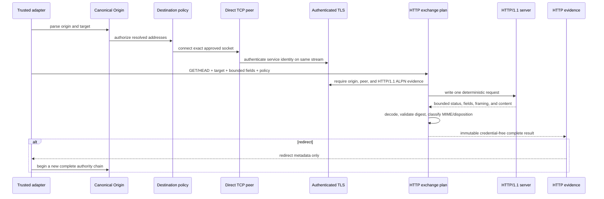

# ADR 0007: Bind bounded HTTP/1.1 semantics to the authenticated TLS stream

- **Status:** Accepted
- **Date:** 2026-08-07
- **Decision owners:** Contextual Wisdom Lab

## Context

ADRs 0004 through 0006 establish a canonical origin, approve a resolved destination, prove the exact operating-system TCP peer, and authenticate the requested TLS service identity on that same stream. Those controls do not determine whether an HTTP response is syntactically unambiguous, complete, resource-bounded, integrity-checked, or safe to hand to a later renderer or download authority.

A trusted HTTPS server can still send conflicting `Content-Length` values, `Transfer-Encoding` together with `Content-Length`, malformed chunk syntax, oversized headers, excessive interim responses, decompression expansion, incomplete content, misleading MIME metadata, unsafe disposition filenames, or redirect targets that would bypass the existing authority chain if followed automatically.

A general-purpose HTTP client also owns broader behavior—connectors, pools, redirect adapters, proxies, cookies, authentication, and runtime integration—that OriginWeave has not authorized. OriginWeave therefore needs a separate HTTP semantics boundary that consumes the already authenticated stream and cannot create another network path.

## Decision

Create an independently reusable `originweave-http` Rust crate. It performs one HTTP/1.1 `GET` or `HEAD` exchange over an existing `AuthenticatedTlsConnection`. The crate owns no DNS, socket connect, reconnect, proxy/PAC, pool, cookie jar, authentication store, filesystem, browser, or model authority.

The exchange is single-use. It emits one deterministic request, parses one final response after a bounded number of informational responses, consumes the connection, and returns content only after all framing, resource, integrity, and metadata checks succeed.

## Authority chain



## Request contract

The first slice supports only `GET` and `HEAD`. The caller supplies a canonical `Origin`, an origin-form path and optional query, validated non-authoritative request fields, and `HttpClientPolicy`.

The crate generates:

```text
<METHOD> <origin-form target> HTTP/1.1
Host: <canonical authority>
Connection: close
Accept-Encoding: gzip, deflate
<validated caller fields>


```

The caller cannot supply `Host`, connection, proxy, framing, authorization, cookie, trailer, or upgrade fields. The request target rejects fragments, controls, whitespace, backslashes, invalid percent escapes, absolute form, authority form, and an encoded size above 8 KiB. Non-ASCII UTF-8 bytes are percent encoded with uppercase hexadecimal. Caller-supplied field values reject leading and trailing OWS before serialization while preserving valid interior SP/HTAB and obs-text bytes.

## Response syntax and framing

The parser accepts only strict `HTTP/1.1` status lines and CRLF-delimited fields. It rejects bare line endings, whitespace before field names, obsolete folding, invalid token bytes, forbidden control bytes, oversized lines or sections, and excessive field counts before allocating retained values.

Body framing follows RFC 9110 and RFC 9112 with additional fail-closed restrictions:

1. `HEAD`, informational responses, `204`, and `304` expose no content.
2. `Transfer-Encoding` plus `Content-Length` is always rejected.
3. Transfer coding is accepted only when the complete coding list is exactly `chunked`.
4. Multiple or comma-separated content lengths are accepted only when every canonical decimal value is identical.
5. A chunked response completes when the terminal zero chunk, bounded optional trailers, and final empty line are complete; peer connection closure is not part of that message boundary.
6. Without either framing field, content is close-delimited and authenticated TLS EOF is required because the request requires connection close.
7. `101 Switching Protocols` is rejected because upgrade is outside this boundary.
8. A partial, malformed, or uncleanly terminated response never becomes a successful complete response.

Chunk extensions are rejected in the first slice. Chunk sizes, cumulative bytes, chunk count, required CRLF, zero chunk, and trailer fields are validated with checked arithmetic and separate limits. Chunked input is reparsed after each bounded TLS read and returns immediately at the unambiguous terminal message boundary. Bytes already buffered beyond that complete boundary are rejected because this slice never reuses parser state for another response.

## Resource budgets

The reviewed maximums are:

| Resource | Maximum |
|---|---:|
| total HTTP exchange timeout | 120 seconds |
| serialized request | 16 KiB |
| request target | 8 KiB |
| status line | 8 KiB |
| fields | 128 |
| one field name | 256 bytes |
| one field value | 8 KiB |
| header section | 64 KiB |
| informational responses | 8 |
| chunks including zero chunk | 65,536 |
| chunk-size line | 16 bytes |
| trailer fields | 32 |
| trailer section | 16 KiB |
| encoded content | 16 MiB |
| decoded content | 32 MiB |
| decoded-to-encoded ratio | 32:1 |
| MIME observation prefix | 1,445 bytes |
| safe filename | 255 UTF-8 bytes |

Callers can reduce but cannot expand these limits. They are product safety budgets, not claims that every larger HTTP message is invalid. Chunked input is validated incrementally before another read can grow the retained prefix: the parser independently enforces chunk-size-line bytes, chunk count, encoded-content bytes, trailer-field count, and trailer-section bytes.

Because the first-slice parser is stateless between reads, it retains the complete unfinished chunked wire prefix. That retained allocation is independently bounded before every `Vec` growth by `max_encoded_content_bytes + max_chunk_count × (MAX_CHUNK_LINE_BYTES + 4) + max_trailer_section_bytes + MAX_CHUNK_LINE_BYTES + 4`. Under the strict defaults this is exactly `18,104,340` bytes, below `18 MiB`. The derived retained-wire cap is a product memory-safety budget rather than an RFC validity rule. When the cap is exhausted, the next TLS read is limited to one sentinel byte and any additional wire data fails closed before the retained buffer can grow beyond the cap.

## Deadline

One monotonic deadline begins before request bytes are written. Before and after every blocking TLS read or write, the crate checks the deadline and sets the underlying socket timeout to the remaining duration. Timeout-like I/O failures and elapsed deadlines become a typed `HttpExchangeTimedOut`. A complete chunked response does not perform an additional blocking read merely to await peer closure. Close-delimited responses still require authenticated TLS EOF. The authenticated stream is consumed by the single-use exchange on both success and failure, so a peer keeping its connection open does not create connection-reuse authority. Timeout restoration is attempted on every path; an existing exchange failure remains primary, and a restoration error replaces the result only when the exchange itself otherwise succeeded.

## Content coding

The first slice accepts no content coding, `identity`, one `gzip`, or one zlib-wrapped `deflate`. Multiple or unknown codings and raw-deflate fallback are rejected. The encoded body is bounded before decoding. Decoding uses an 8 KiB scratch buffer and checks decoded bytes and expansion ratio after every read before extending the output.

The implementation pins `flate2` 1.1.9 with default features disabled and the explicit portable pure-Rust backend. Decoder errors remain available through the standard error chain without including content bytes.

## Integrity

RFC 9530 defines `Content-Digest` and `Repr-Digest` using the Structured Fields version published as RFC 8941. RFC 9651 is the current Structured Fields standard and obsoletes RFC 8941, but RFC 9651 explicitly preserves version binding for fields defined by an earlier Structured Fields specification; its later Date and Display String bare-item types are therefore not retroactively valid RFC 9530 parameter values. The relevant dictionary semantics are consistent across RFC 8941 and RFC 9651: repeated field lines are combined in message order, duplicate dictionary keys use the last occurrence, optional whitespace around dictionary commas includes SP and HTAB, and Item parameters are valid extensibility metadata unless the field specification constrains them.

RFC 9530 requires each digest member value itself to be a Byte Sequence and explicitly permits a digest trailer to be merged into the corresponding header field. OriginWeave therefore parses header members first and trailer members second, accepts RFC 8941 parameter bare-item types without assigning them security meaning, validates the complete parameter syntax, and lets later duplicate keys replace earlier values before digest verification. The implementation does not silently upgrade RFC 9530 to RFC 9651-only parameter types.

RFC 8941 Byte Sequence parsing permits a recipient to synthesize missing Base64 padding and says parsers should not fail solely because `=` padding is absent when their decoder can be configured accordingly. The pinned `base64` 0.22.1 decoder is therefore configured with `DecodePaddingMode::Indifferent`, accepting canonical or omitted padding. Invalid alphabet characters and impossible lengths remain errors. OriginWeave intentionally keeps the decoder's strict rejection of non-zero trailing bits as an additional fail-closed restriction; changing that interoperability choice requires separate review.

The first slice verifies `sha-256` and `sha-512` only. Every supported digest value remaining after Structured Fields parsing must match the applicable bytes. Unsupported algorithm members remain typed as unsupported rather than becoming an implicit verification result. Malformed dictionary syntax, malformed Byte Sequences, invalid parameter bare items, and invalid Structured Fields keys fail closed. A syntactically valid empty Byte Sequence is not rejected as Structured Fields syntax, but it cannot match the fixed-length output of a supported SHA algorithm and therefore produces `DigestMismatch`.

`Content-Digest` covers message content after transfer coding removal and before content-coding decoding. `Repr-Digest` is validated only for a complete status-200 full representation context supported by the first slice; other semantically ambiguous contexts record `UnsupportedContext`.

An unsigned digest is evidence against accidental corruption. It is not authentication, authorization, privacy, or protection against a malicious actor who can replace both content and digest.

## MIME and disposition

The crate parses supplied `Content-Type` metadata and observes at most 1,445 decoded bytes through a versioned conservative signature table. It distinguishes supplied and observed types, `nosniff`, match/mismatch, active or scriptable classes, archives, and binary fallback. It does not execute or render content and does not claim to implement every branch of the WHATWG MIME algorithm.

`Content-Disposition` can produce safe `inline` or `attachment` metadata with a bounded filename. Validation happens after quoted-string or extended-value decoding and rejects controls, path separators, absolute paths, drive and UNC paths, dot segments, bidi controls, trailing dot/space, Windows device basenames, excessive bytes, ambiguous percent decoding, and the Win32 reserved filename characters `<`, `>`, `:`, `"`, `/`, `\`, `|`, `?`, and `*`. No file is created. The policy is intentionally portable and fail-closed before a future download adapter chooses a filesystem-specific persistence rule.

## Redirects

Redirect status and `Location` are returned as hashed, bounded metadata. The raw location and query values are not copied into evidence. A single-leading-slash absolute-path reference can remain same-origin metadata. A `//authority/path` value is an RFC 3986 network-path reference, not a same-origin path; because this crate deliberately does not own base-URI resolution, it rejects network-path references instead of erasing their authority. The HTTP crate never follows a redirect. A caller must send an admitted target through canonical origin parsing, destination approval, exact TCP peer proof, TLS authentication, capability and risk policy, and a new HTTP exchange.

## Evidence

`HttpExchangeEvidence` records:

- canonical origin and inherited requested/observed peer;
- TLS protocol and ALPN summary;
- request method, target hash, query-present flag, and bounded path prefix;
- HTTP version and status;
- informational response count;
- field names and byte counts without arbitrary values;
- framing, chunk, trailer, encoded, decoded, and coding decisions;
- digest status and algorithm identifiers;
- supplied and observed MIME, classifier version, no-sniff, and mismatch class;
- safe disposition and redirect metadata or explicit absence;
- completeness, elapsed duration, deadline, and every configured limit.

Evidence never contains request query values, response bodies, raw locations, cookies, authorization values, unsafe filenames, certificates, or secret material.

## Error contract

Public errors implement deterministic `Display` and `std::error::Error`. Typed variants distinguish policy, target, request field, ALPN, syntax, framing, chunk, trailer, content, decoding, digest, MIME, disposition, redirect, deadline, I/O, completeness, and timeout-restoration failures. Safe underlying I/O and decoder errors remain accessible through `source()`.

## Security boundary

The crate does **not**:

- resolve DNS or create a socket;
- reconnect, pool, or reuse a connection;
- inherit proxy or PAC settings;
- follow redirects;
- retain cookies or authentication credentials;
- write files, extract archives, or execute content;
- render HTML, SVG, PDF, or JavaScript;
- control Chromium, CDP, WebDriver BiDi, WebMCP, or MCP;
- invoke an LLM;
- claim that HTTP success proves content safety or business authorization.

## Alternatives rejected

### General-purpose client in the authority kernel

Rejected for the first slice because connector, pool, redirect, proxy, cookie, and runtime behavior would enlarge the trusted computing base and make exact-stream evidence harder to prove.

### Rely on TLS for message completeness

Rejected because TLS authenticates records on one connection but does not resolve HTTP framing ambiguity, resource limits, content coding, MIME semantics, or redirects.

### Buffer unbounded content before validation

Rejected because declared lengths and compressed data are attacker controlled. Every allocation and decoder read must remain within reviewed budgets.

### Wait for connection close after a complete chunked message

Rejected because RFC 9112 makes chunked transfer coding self-delimiting and usable on persistent connections. Treating TLS EOF as an additional chunked delimiter converts a valid persistent peer into a timeout failure and conflates connection lifetime with message framing.

### Follow redirects inside the HTTP crate

Rejected because each target is a new origin, destination, peer, TLS, capability, and policy decision.

### Treat every slash-prefixed Location as same-origin

Rejected because RFC 3986 distinguishes `//authority/path` network-path references from `/path` absolute-path references. Erasing the authority would undermine redirect reauthorization evidence.

### Infer file type from URL extension

Rejected because extensions are attacker-controlled metadata and do not establish content type.

## Consequences

### Positive

- One exact authenticated stream yields one unambiguous complete HTTP result.
- Framing, resource, integrity, and metadata decisions are typed and reproducible.
- Chunked responses interoperate with peers that keep the connection open after the terminal message boundary.
- Redirects cannot bypass the existing trust boundaries.
- No browser or general client dependency is required.
- The crate is reusable by OriginWeave, naruon, and other CWL services.

### Negative

- HTTP/1.1 only and a single-use `Connection: close` request policy reduce performance and compatibility; a peer's close timing nevertheless does not define completion for an already complete chunked message.
- Strict syntax rejects some legacy but interoperable messages.
- The bounded decoded body is materialized in memory; larger downloads need a future bounded sink authority.
- The observed MIME table is deliberately conservative and incomplete.
- Authentication, cookies, proxying, caching, HTTP/2/3, downloads, and rendering remain unavailable.

## Verification

The merge gate requires pure parser and property-style boundary tests, byte-truncation tests, deterministic error tests, real loopback HTTPS success and adversary scenarios, a persistent-peer chunked fixture proving success at the zero-chunk/trailer boundary before TLS close, a production-calculation contract fixing the strict-default retained chunked wire cap at `18,104,340` bytes plus exact over-cap rejection before buffer growth, proof of exactly one connection, hard deadline tests, digest known-answer vectors, RFC 8941 parameter/duplicate-key/repeated-field/trailer-merge interoperability cases, canonical and omitted-padding Byte Sequence interoperability with malformed-alphabet/length/trailing-bit rejection, explicit rejection of RFC 9651-only parameter bare-item types for this RFC 9530 field definition, SP/HTAB OWS coverage around dictionary delimiters, MIME/disposition cases, network-path redirect rejection, Win32-reserved filename rejection after decoding, static forbidden-source scans, complete public rustdoc, and exact 100% production function, line, region, and branch coverage on the pull-request head.

## Standards

RFC 9110 defines current HTTP semantics. RFC 9112 defines HTTP/1.1 syntax and framing, including chunked transfer coding as a self-delimiting message body compatible with persistent connections. RFC 3986 defines URI-reference forms and distinguishes network-path references from absolute-path references. RFC 9530 defines `Content-Digest` and `Repr-Digest`, binds their Structured Fields syntax to RFC 8941, permits digest trailer-to-header merging, and obsoletes RFC 3230. RFC 9651 is the current Structured Fields standard and obsoletes RFC 8941, while retaining version-specific interpretation for fields defined against an earlier Structured Fields RFC. RFC 6266 defines HTTP `Content-Disposition`. Microsoft documents the Win32 reserved filename characters and device names enforced by the portable handoff policy. The WHATWG MIME Sniffing Living Standard informs the versioned conservative observation table. Full APA 7th references and the evidence-to-decision trace are recorded in `docs/doctoring.md` and the focused doctoring addenda under `docs/doctoring/`.
