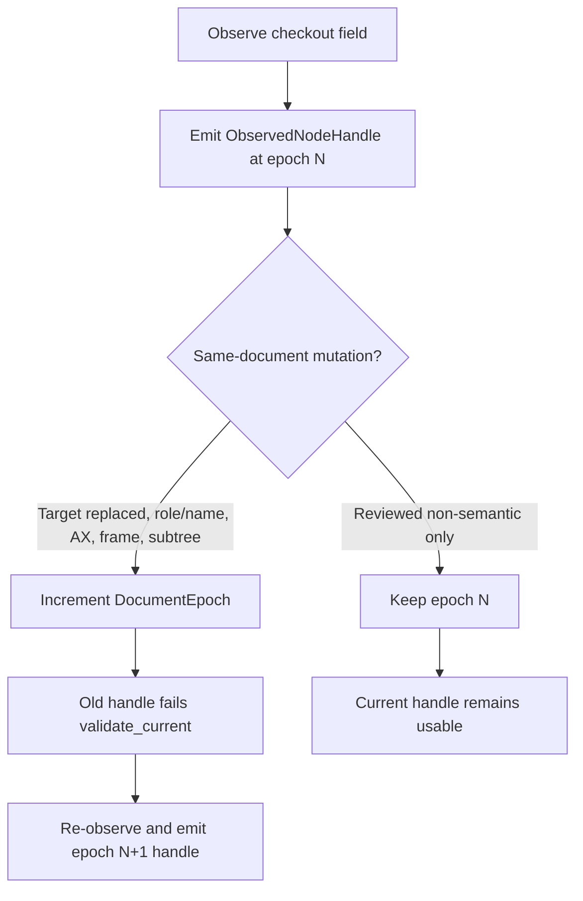

# Browser Session and Context Node Authority

## Governing question

What minimum identity must OriginWeave retain before a future browser adapter may act on a previously observed node?

## Primary-spec evidence

WebDriver defines each browsing context as having a unique window handle. Its known-element algorithm resolves an element reference with both the active session and that session's current browsing context. It returns `no such element` when the reference is unknown in that scope and `stale element reference` when the resolved node is no longer attached to the active document.

WebDriver BiDi makes browsing contexts explicit protocol objects and associates navigation behavior with the selected context. Because these external protocol identifiers and their lifecycle remain adapter concerns, OriginWeave must not expose them directly as durable product authority.

## Product decision

The Rust safety kernel uses independently validated opaque identities for:

- the active browser automation session;
- the independently navigable browsing context;
- the canonical origin observed in that context;
- the actionable document lifetime; and
- the adapter-local node identifier.

A future adapter must translate WebDriver, WebDriver BiDi, CDP, renderer, frame-tree, or DOM identifiers through a session-scoped registry. It must allocate a fresh document epoch when navigation, document replacement, or a relevant same-document mutation makes earlier references unsafe. Immediately before an action, it must compare every authority component and fail closed on a session, context, origin, or epoch mismatch.

Same-document mutations are classified by `SameDocumentMutationKind` before any handle is reused. Target removal or replacement, role or accessible-name change, accessibility-tree invalidation, nested-frame document replacement, and actionable subtree replacement increment the epoch. A reviewed non-semantic mutation may keep the current epoch only when the adapter already has deterministic evidence that no emitted handle can change meaning. Overflow of the epoch identifier fails closed. This decision function does not watch the live DOM; the adapter still has to observe MutationObserver, accessibility, or BiDi lifecycle events and feed the matching kind.

This contract is deliberately stricter than testing only whether a local node number still exists. Same-origin tabs, frames, isolated profiles, or parallel sessions may reuse the same local identifier while referring to different nodes. It also does not convert a valid node handle into an action capability, origin grant, destination grant, approval, or proof of a successful post-condition.

## Required regression evidence

- zero-valued session, context, epoch, and node identifiers are rejected;
- a handle validates only in the exact session and context that produced it;
- same-origin cross-session and cross-context reuse is rejected;
- cross-origin reuse is rejected;
- stale document epochs are rejected;
- a same-document target replacement rotates the epoch and rejects the previous handle;
- a reviewed non-semantic mutation may preserve the current handle;
- document-epoch overflow fails closed;
- errors remain deterministic and implement `std::error::Error`;
- all public contracts remain documented and production behavior remains exactly covered.

## References

Web Hypertext Application Technology Working Group. (2026). *DOM standard*. https://dom.spec.whatwg.org/

World Wide Web Consortium. (2023, June 6). *Accessible Rich Internet Applications (WAI-ARIA) 1.2* (W3C Recommendation). https://www.w3.org/TR/wai-aria-1.2/

World Wide Web Consortium. (2026). *WebDriver*. Retrieved August 16, 2026, from https://www.w3.org/TR/webdriver2/

World Wide Web Consortium. (2026). *WebDriver BiDi*. Retrieved August 9, 2026, from https://w3c.github.io/webdriver-bidi/
