# OriginWeave Conceptual ERD and Durable Domain Model

- **Status:** Proposed authoritative logical model
- **Persistence status:** Conceptual unless a specific adapter/schema is marked Implemented elsewhere
- **Naming:** Descriptive two-or-more-word `snake_case`
- **Technical requirements:** [`../TRD.md`](../TRD.md)

This model exists even though OriginWeave does not yet implement every entity as a relational table. It prevents session, authority, evidence, provenance, resource, and secret concepts from being silently collapsed when persistence adapters are introduced.

## 1. Persistence truth

The following distinction is mandatory:

- **Implemented value/evidence concept** — represented by current Rust code, but not necessarily durably persisted.
- **Planned durable record** — conceptual entity required for future headless/browser/enterprise persistence.
- **Adapter-owned representation** — may live in relational storage, WARC, object storage, PROV serialization, or another versioned adapter.

The ERD does **not** authorize direct cross-service database access. Other CWL products integrate through versioned APIs/events/artifacts rather than querying OriginWeave application tables.

## 2. Conceptual ERD

```mermaid
erDiagram
    tenant_record ||--o{ browser_profile : owns
    tenant_record ||--o{ agent_session : owns
    tenant_record ||--o{ extraction_schema : governs
    browser_profile ||--o{ agent_session : supplies
    agent_session ||--o{ browsing_context : contains
    browsing_context ||--o{ page_snapshot : produces
    page_snapshot ||--o{ semantic_node : contains

    agent_session ||--o{ action_intent : scopes
    semantic_node o|--o{ action_intent : targets
    action_intent ||--o{ policy_decision : evaluated_by
    action_intent ||--o{ approval_evidence : may_require
    action_intent ||--o{ action_event : executes_as
    action_event ||--o{ postcondition_evidence : verifies

    agent_session ||--o{ origin_authority : grants
    origin_authority ||--o{ resolution_snapshot : resolves_to
    resolution_snapshot ||--o{ route_decision : routes
    route_decision ||--o{ connection_evidence : connects
    connection_evidence ||--o{ tls_identity_evidence : authenticates
    tls_identity_evidence ||--o{ http_exchange : carries
    http_exchange ||--o{ network_exchange : records

    agent_session ||--o{ sensitive_authority : scopes
    sensitive_authority ||--o{ secret_handle : authorizes
    secret_handle ||--o{ access_receipt : records_use
    action_event o|--o{ access_receipt : consumes

    agent_session ||--|| resource_budget : governed_by
    agent_session ||--o{ resource_snapshot : observes
    resource_budget ||--o{ mitigation_plan : derives
    resource_snapshot ||--o{ mitigation_plan : informs

    page_snapshot ||--o{ source_resource : references
    network_exchange ||--o{ source_resource : captures
    source_resource ||--o{ content_record : materializes
    content_record ||--o{ extracted_value : supports
    extraction_schema ||--o{ extracted_value : constrains
    semantic_node o|--o{ extracted_value : supports
    extracted_value ||--o{ provenance_record : derives
    action_event ||--o{ provenance_record : contributes
    policy_decision ||--o{ provenance_record : contributes
    postcondition_evidence ||--o{ provenance_record : contributes

    agent_session ||--o{ task_checkpoint : checkpoints
    agent_session ||--o{ download_artifact : produces
    source_resource o|--o{ download_artifact : originates
    tenant_record ||--o{ extension_grant : governs
    browser_profile ||--o{ extension_grant : applies

    tenant_record {
        string tenant_record_id PK
        string policy_version
        string residency_profile
        string lifecycle_state
    }

    browser_profile {
        string browser_profile_id PK
        string tenant_record_id FK
        string profile_class
        string isolation_mode
    }

    agent_session {
        string agent_session_id PK
        string tenant_record_id FK
        string browser_profile_id FK
        string session_mode
        string execution_purpose
        string lifecycle_state
    }

    browsing_context {
        string browsing_context_id PK
        string agent_session_id FK
        string context_kind
        string canonical_origin
        integer document_epoch
    }

    page_snapshot {
        string page_snapshot_id PK
        string browsing_context_id FK
        integer document_epoch
        string snapshot_digest
        string captured_at
    }

    semantic_node {
        string semantic_node_id PK
        string page_snapshot_id FK
        string role_code
        string accessible_name_digest
        string authority_digest
    }

    action_intent {
        string action_intent_id PK
        string agent_session_id FK
        string semantic_node_id FK
        string action_kind
        string target_origin
        string intent_digest
        string risk_class
    }

    policy_decision {
        string policy_decision_id PK
        string action_intent_id FK
        string policy_version
        string decision_code
        string decided_at
    }

    approval_evidence {
        string approval_evidence_id PK
        string action_intent_id FK
        string approval_kind
        string approved_intent_digest
        string approved_at
        string expires_at
    }

    action_event {
        string action_event_id PK
        string action_intent_id FK
        string attempt_state
        string started_at
        string completed_at
    }

    postcondition_evidence {
        string postcondition_evidence_id PK
        string action_event_id FK
        string expectation_kind
        string verification_state
        string observed_at
    }

    origin_authority {
        string origin_authority_id PK
        string agent_session_id FK
        string canonical_origin
        string capability_scope
        string expires_at
    }

    resolution_snapshot {
        string resolution_snapshot_id PK
        string origin_authority_id FK
        string address_set_digest
        integer address_count
        string approved_at
    }

    route_decision {
        string route_decision_id PK
        string resolution_snapshot_id FK
        string route_kind
        string proxy_origin
        string pac_origin
    }

    connection_evidence {
        string connection_evidence_id PK
        string route_decision_id FK
        string requested_socket
        string observed_socket
        integer attempt_number
    }

    tls_identity_evidence {
        string tls_identity_evidence_id PK
        string connection_evidence_id FK
        string canonical_origin
        string reference_identity
        string trust_bundle_digest
        string tls_version
    }

    http_exchange {
        string http_exchange_id PK
        string tls_identity_evidence_id FK
        string method_code
        integer status_code
        string framing_state
        string integrity_state
    }

    network_exchange {
        string network_exchange_id PK
        string http_exchange_id FK
        string canonical_origin
        string bounded_path
        string captured_at
    }

    sensitive_authority {
        string sensitive_authority_id PK
        string agent_session_id FK
        string field_identifier
        string purpose_code
        string destination_origin
        string data_classification
    }

    secret_handle {
        string secret_handle_id PK
        string sensitive_authority_id FK
        string handle_state
        integer maximum_uses
        string expires_at
    }

    access_receipt {
        string access_receipt_id PK
        string secret_handle_id FK
        string action_event_id FK
        string decision_outcome
        string policy_version
        string retention_until
    }

    resource_budget {
        string resource_budget_id PK
        string agent_session_id FK
        integer cpu_worker_limit
        integer ram_byte_limit
        integer vram_byte_limit
        string budget_version
    }

    resource_snapshot {
        string resource_snapshot_id PK
        string agent_session_id FK
        integer cpu_worker_count
        integer ram_bytes
        integer vram_bytes
        string observed_at
    }

    mitigation_plan {
        string mitigation_plan_id PK
        string resource_budget_id FK
        string resource_snapshot_id FK
        boolean reject_admission
        boolean pause_agent
        boolean offload_model
    }

    source_resource {
        string source_resource_id PK
        string page_snapshot_id FK
        string network_exchange_id FK
        string source_kind
        string source_locator
        string content_digest
    }

    content_record {
        string content_record_id PK
        string source_resource_id FK
        string content_kind
        string media_type
        string content_digest
        integer content_bytes
        string retention_class
    }

    extraction_schema {
        string extraction_schema_id PK
        string tenant_record_id FK
        string schema_name
        string schema_version
        string schema_digest
        string lifecycle_state
    }

    extracted_value {
        string extracted_value_id PK
        string content_record_id FK
        string extraction_schema_id FK
        string semantic_node_id FK
        string field_name
        string value_digest
        string verification_state
    }

    provenance_record {
        string provenance_record_id PK
        string extracted_value_id FK
        string action_event_id FK
        string policy_decision_id FK
        string postcondition_evidence_id FK
        string provenance_digest
    }

    task_checkpoint {
        string task_checkpoint_id PK
        string agent_session_id FK
        string checkpoint_digest
        string created_at
        string recovery_state
    }

    download_artifact {
        string download_artifact_id PK
        string agent_session_id FK
        string source_resource_id FK
        string content_digest
        string mime_state
        integer artifact_bytes
    }

    extension_grant {
        string extension_grant_id PK
        string tenant_record_id FK
        string browser_profile_id FK
        string extension_identifier
        string capability_scope
        string grant_state
    }
```



## 3. Core aggregate boundaries

### Session aggregate

Root: `agent_session`

Owns or scopes:

- `browser_profile` association;
- `browsing_context`;
- task mode/purpose;
- `resource_budget`;
- `task_checkpoint`;
- task-scoped origin and sensitive authority.

A session does not imply network, secret, or action permission by itself.

### Observation aggregate

Root: `page_snapshot`

Owns:

- exact `document_epoch`;
- `semantic_node` values;
- source references;
- snapshot digest and observation time.

A node is never a global primary key for browser state; its authority is meaningful only with the session/context/origin/document lifetime represented by the adapter/core contract.

### Action aggregate

Root: `action_intent`

Links:

- exact typed intent and digest;
- deterministic `policy_decision`;
- optional `approval_evidence`;
- one or more execution `action_event` attempts;
- resulting `postcondition_evidence`.

Approval and execution evidence are separate records because approval does not prove that the action ran and an action event does not prove the expected outcome occurred.

### Network authority aggregate

The sequence is intentionally decomposed:

```text
origin_authority
-> resolution_snapshot
-> route_decision
-> connection_evidence
-> tls_identity_evidence
-> http_exchange
-> network_exchange
```

No downstream record retroactively grants an upstream authority.

### Sensitive-data aggregate

```text
sensitive_authority
-> secret_handle
-> access_receipt
```

The protected value is deliberately absent from the conceptual audit entities. Storage adapters may need encrypted secret material, but that material belongs to a dedicated trusted secret store rather than general evidence tables.

### Content and extraction aggregate

```text
source_resource
-> content_record
-> extracted_value
extraction_schema
-> extracted_value
```

`source_resource` identifies where evidence came from; `content_record` identifies a bounded retained representation of that source; `extraction_schema` identifies the versioned contract used to interpret content; and `extracted_value` records a derived field without pretending that its digest is the source itself. A screenshot, HTTP body, DOM-derived record, WARC member, or download may therefore have separate storage/export representations while keeping one conceptual source/content/extraction lineage. Protected secrets do not become `content_record` payloads merely because a page used them.

### Evidence/provenance aggregate

```text
source_resource
-> content_record
-> extracted_value
-> provenance_record
```

`provenance_record` can also reference action, policy, and post-condition evidence so a buyer can trace both extracted facts and state-changing results. The extraction schema is an independent versioned authority for interpretation and does not merge with source-content identity or provenance truth.

## 4. Identity rules

- Durable IDs are opaque and nonnumeric where practical.
- Adapter-local CDP/WebDriver/node/process identifiers are not durable core identifiers.
- Digests are content/intent/evidence identifiers, not authorization by themselves.
- A canonical origin string is a logical identity, not a database key for authorization state.
- A `secret_handle_id` is opaque authority reference metadata, never the protected value.
- `source_resource_id`, `content_record_id`, `extraction_schema_id`, and `extracted_value_id` remain separate so storage identity, interpretation contract, and derived-value identity cannot collapse into one identifier.

## 5. Temporal rules

Persisted event/evidence records use trusted server/runtime times appropriate to the boundary. Client/page timestamps may be captured as data but are not authoritative for expiry, approval, secret use, or policy transitions.

At minimum, future durable task implementations distinguish:

- event occurrence/start/end time when known;
- runtime observation/decision time;
- external-page supplied time as untrusted source data;
- retention/expiry time;
- model/provider completion time where relevant.

## 6. Privacy and retention rules

- Evidence defaults to data minimization and universal redaction for generic network values.
- Protected values are not duplicated into audit/provenance tables or ordinary `content_record` payloads.
- Tenant/resource authorization applies before record access, not after retrieval.
- Retention is purpose/classification aware and can differ between source metadata, retained content, derived values, and accountability records.
- Export and deletion operations preserve integrity/accountability records only to the extent required by the governing policy or law; the exact enterprise lifecycle remains Planned.

## 7. Adapter mapping guidance

A relational adapter might persist `agent_session`, policy/action metadata, extraction schema metadata, and indexes. WARC may persist eligible source/content protocol material. Object storage may hold screenshots/downloads or larger `content_record` payloads. PROV serialization may represent derivation. These are parallel representations of bounded concepts, not permission to duplicate secrets or bypass data-minimization rules.

## 8. ERD change control

Update this file when an Accepted or implemented change alters:

- durable entity identity or ownership;
- session/context/document lifetime;
- action/approval/post-condition relationships;
- network authority sequence;
- sensitive-data handle lifecycle;
- content/extraction schema lineage;
- resource-governor evidence;
- provenance derivation;
- tenant/extension governance.

A new database table alone does not justify changing the conceptual model if it is an implementation detail; conversely, a new durable domain concept must appear here even if its persistence adapter is not yet implemented.
