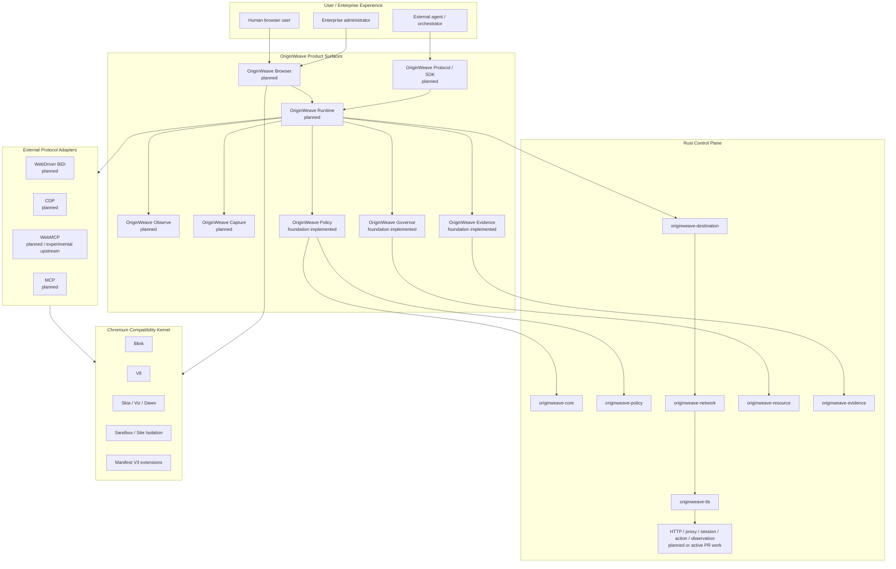
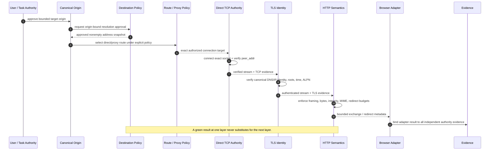
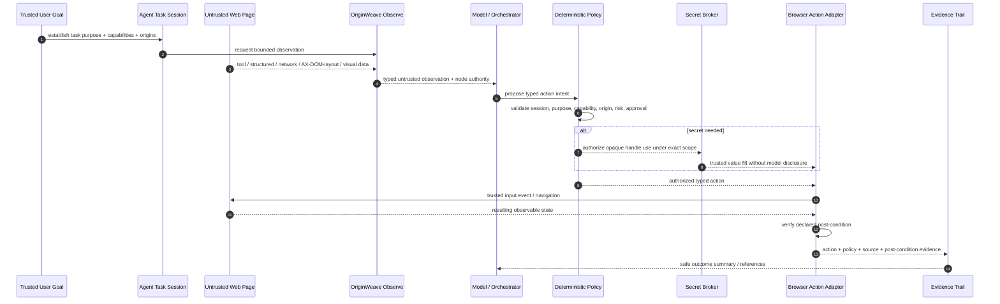
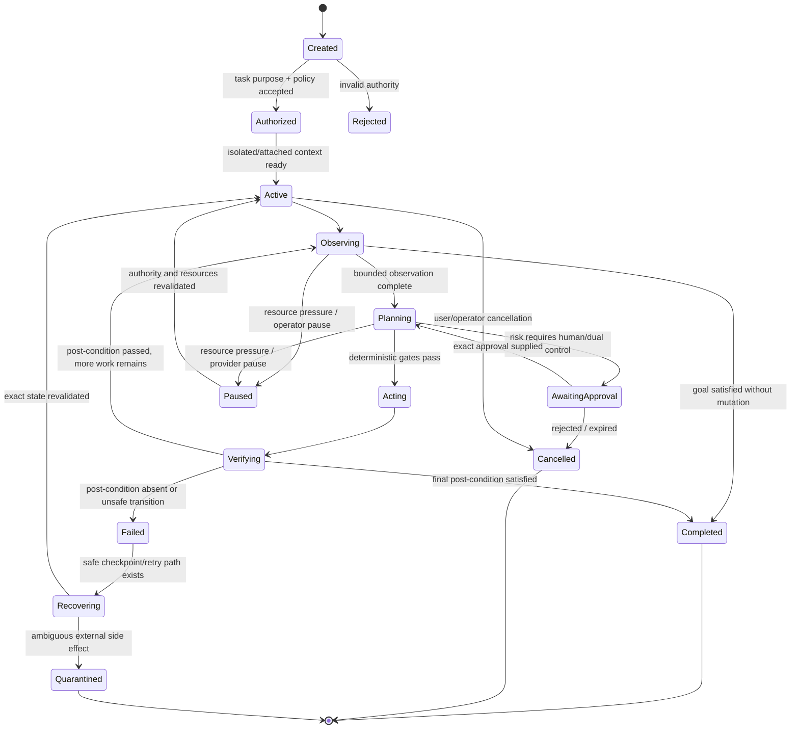
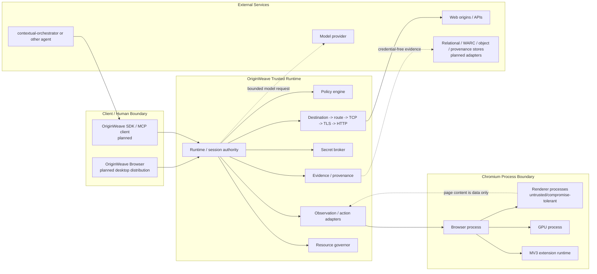
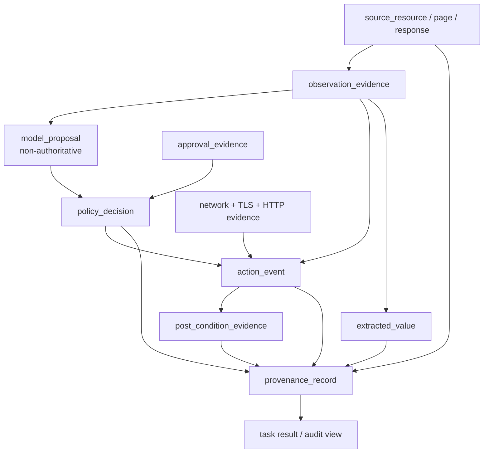

# OriginWeave UML and Control-Flow Diagrams

- **Status:** Proposed authoritative diagram pack
- **Notation:** Mermaid diagram-as-code
- **Textual authority:** [`../../ARCHITECTURE.md`](../../ARCHITECTURE.md), [`../TRD.md`](../TRD.md), and Accepted ADRs

These diagrams visualize governing boundaries; they do not imply that every planned adapter is already shipped. Labels use `implemented`, `active`, or `planned` where implementation status matters.

## 1. Component and bounded-context view

## 2. Network and service-authority sequence

## 3. Observation-to-action sequence

## 4. Delegated-task state machine

The complete durable runtime state machine is **Planned**. The important contract is that cancellation, resource pause, approval, failure, ambiguous external effects, and post-condition verification are explicit states rather than hidden boolean flags.

## 5. Deployment and trust-boundary topology

## 6. Evidence authority flow

A model proposal can explain *why an action was proposed* but is not mergeable with `policy_decision`, `approval_evidence`, `network` authority, or `post_condition_evidence` into one undifferentiated success status.

## 7. Diagram maintenance rules

Update this pack when a protected change materially alters:

- product/bounded-context ownership;
- authority ordering or trust boundaries;
- task/session lifecycle;
- observation hierarchy or action lifecycle;
- deployment boundaries;
- evidence/provenance relationships.

A feature-specific ADR may include a more detailed sequence diagram, but this pack remains the product-wide view and must not require maintainers to reconstruct the complete system from scattered ADR diagrams.
