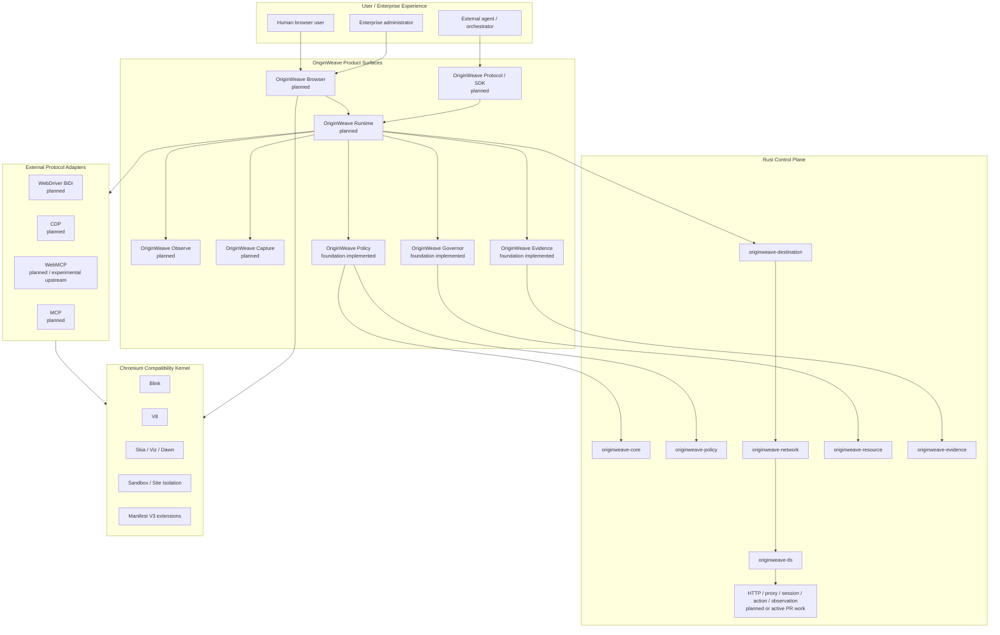
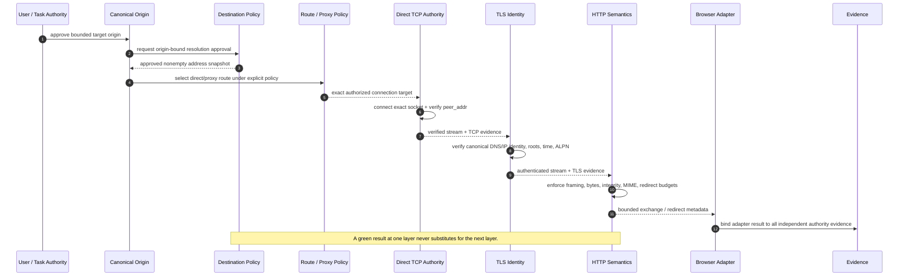
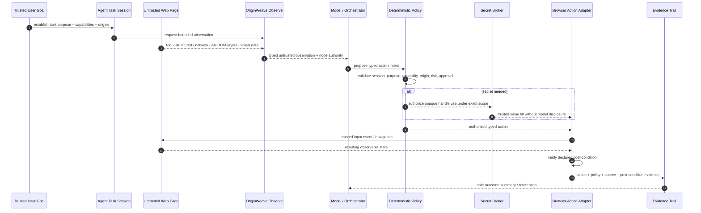
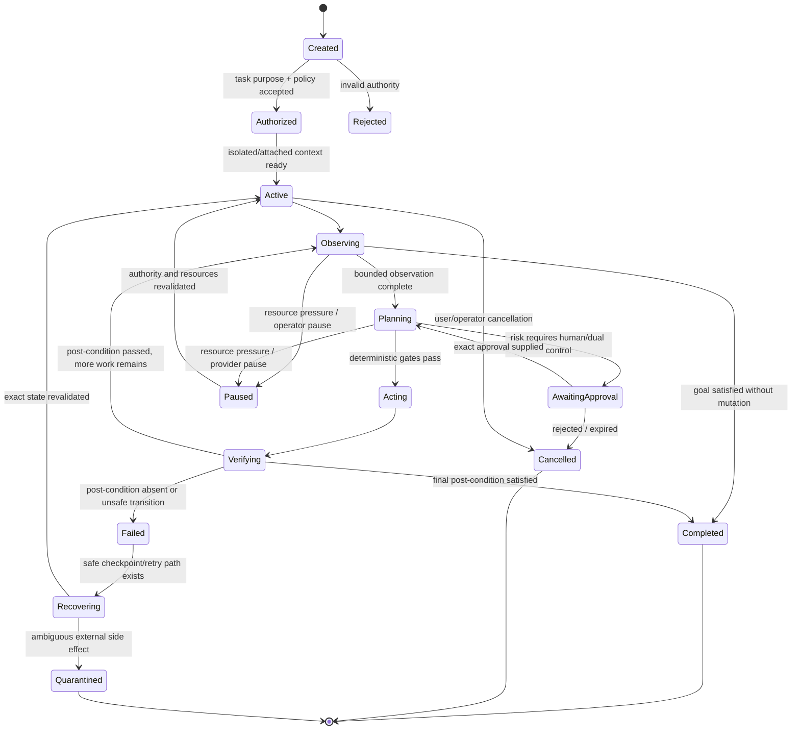
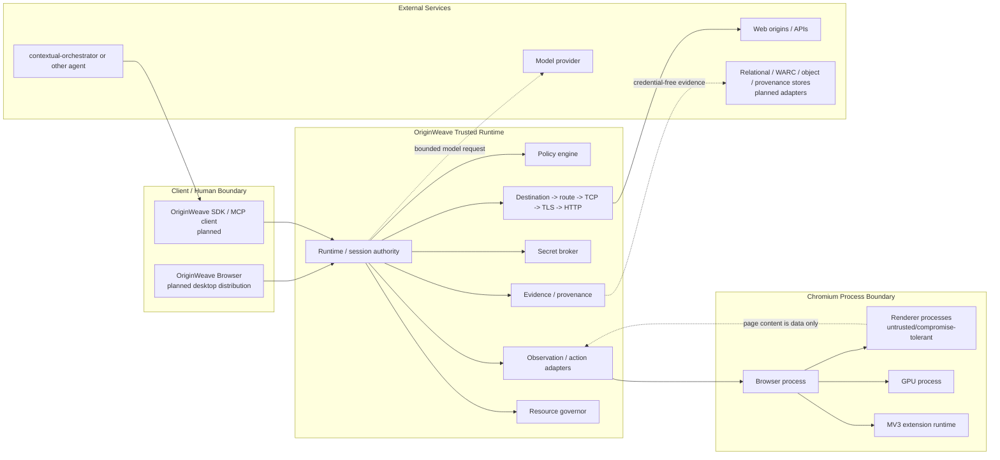
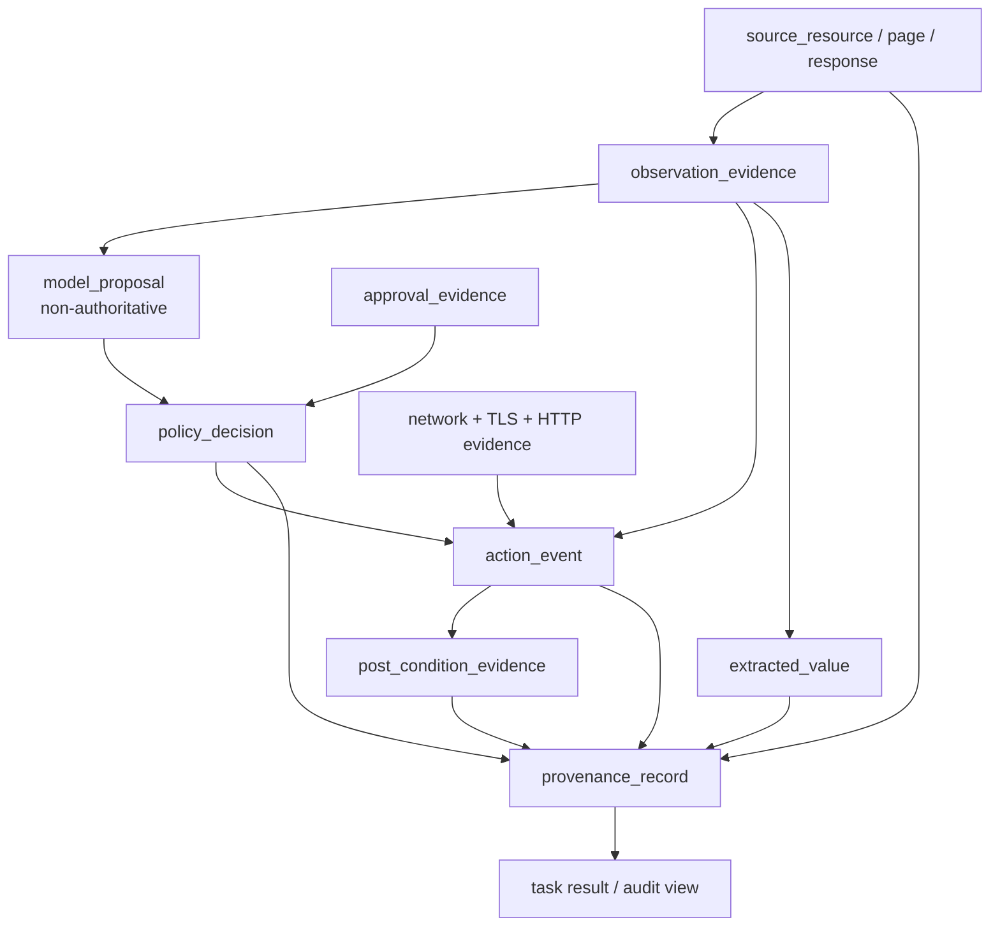
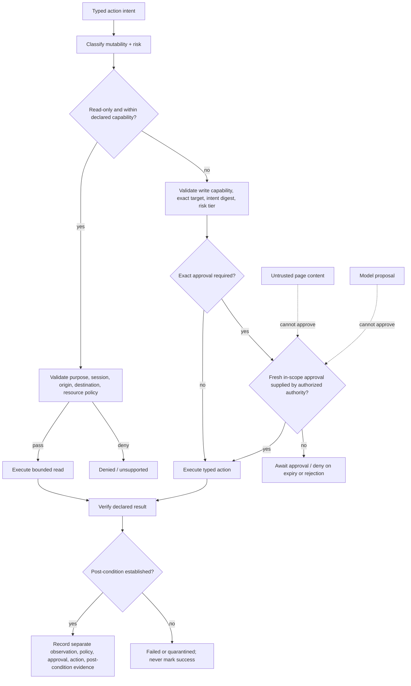
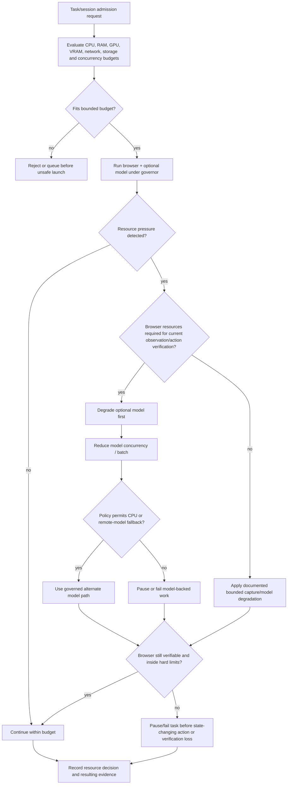
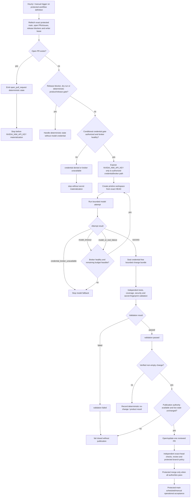

# OriginWeave UML and Control-Flow Diagrams

- **Status:** Proposed authoritative diagram pack
- **Notation:** Mermaid diagram-as-code
- **Textual authority:** [`../../ARCHITECTURE.md`](../../ARCHITECTURE.md), [`../TRD.md`](../TRD.md), and Accepted ADRs

These diagrams visualize governing boundaries; they do not imply that every planned adapter is already shipped. Labels use `implemented`, `active`, or `planned` where implementation status matters.

## 1. Component and bounded-context view



## 2. Network and service-authority sequence



## 3. Observation-to-action sequence



## 4. Delegated-task state machine



The complete durable runtime state machine is **Planned**. The important contract is that cancellation, resource pause, approval, failure, ambiguous external effects, and post-condition verification are explicit states rather than hidden boolean flags.

## 5. Deployment and trust-boundary topology



## 6. Evidence authority flow



A model proposal can explain *why an action was proposed* but is not mergeable with `policy_decision`, `approval_evidence`, `network` authority, or `post_condition_evidence` into one undifferentiated success status.

## 7. Secret-fill sequence

```mermaid
sequenceDiagram
    autonumber
    participant Goal as Trusted User / Enterprise Authority
    participant Session as Governed Session / Task
    participant Model as Model / Planner
    participant Policy as Deterministic Policy
    participant Broker as Secret Broker
    participant Adapter as Trusted Browser Adapter
    participant Page as Untrusted Page
    participant Evidence as Credential-free Evidence

    Goal->>Session: authorize purpose, origin, capability, task scope
    Model->>Policy: propose secret_fill(opaque_handle, target, action_intent)
    Note over Model,Policy: Model never receives the raw secret.
    Policy->>Policy: validate mode, purpose, capability, origin, risk, approval, exact scope
    alt authority mismatch / stale approval / invalid handle scope
        Policy-->>Model: deny without broker resolution
        Policy-->>Evidence: denial + scope references
    else policy permits broker use
        Policy->>Broker: resolve opaque handle under exact authorized scope
        Broker->>Broker: validate tenant/task, destination, expiry, revocation, use policy
        alt broker validation fails
            Broker-->>Policy: fail closed
            Policy-->>Evidence: broker denial without raw value
        else broker validation succeeds
            Broker-->>Adapter: minimum secret value on trusted delivery path
            Adapter->>Page: fill only the authorized field/action
            Page-->>Adapter: resulting observable state
            Adapter-->>Evidence: delivery reference + post-condition; no raw secret
        end
    end
```

Page content, model output, logs, and evidence can reference an opaque handle or redacted fingerprint but cannot request broker authority or receive the durable raw value merely by describing it.

## 8. Read/write risk approval flow



A page, model, comment, status check, or other observation cannot synthesize approval. Approval is an independent authority bound to the action contract, and a valid approval does not substitute for post-condition verification.

## 9. Resource-pressure and fallback flow



The browser is not unbounded: browser correctness is prioritized over optional model acceleration, but hard host and tenant limits still fail closed. A task cannot be recorded as successfully changed when resource eviction prevents the browser from establishing its post-condition.

## 10. Hourly product-development gate-to-model flow



The credential decision is fail closed: `credential denied or broker unavailable` reaches `stop without secret materialization`. The validation decision is also fail closed: `validation failed` reaches `fail closed without publication`; only `validation passed` can proceed to non-empty-change and publication decisions.

This diagram describes the governing workflow architecture and closure contract. It is not evidence that an active incident repair has merged or that protected-main acceptance has already occurred. `COPILOT_GITHUB_TOKEN`, invented PATs, raw-secret rematerialization, synthesized approval, and fail-open publication are outside the design.

## 11. Diagram maintenance rules

Update this pack when a protected change materially alters:

- product/bounded-context ownership;
- authority ordering or trust boundaries;
- task/session lifecycle;
- observation hierarchy or action lifecycle;
- secret-broker delivery or approval semantics;
- resource admission, pressure, or browser/model fallback priority;
- hourly deterministic/model gate ordering or operational-closure evidence;
- deployment boundaries;
- evidence/provenance relationships.

A feature-specific ADR may include a more detailed sequence diagram, but this pack remains the product-wide view and must not require maintainers to reconstruct the complete system from scattered ADR diagrams.
