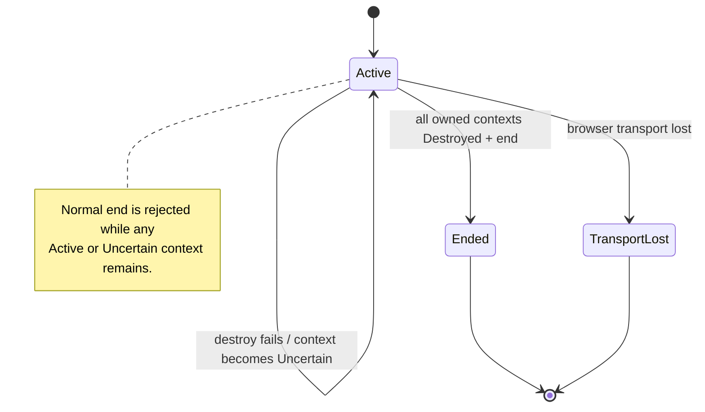

# Browser Session lifecycle authority

This diagram describes the active-pr domain contract introduced for issue #312. It is not evidence that a WebDriver BiDi or Chromium adapter already implements the port.

```mermaid
sequenceDiagram
    autonumber
    participant C as Application service
    participant S as BrowserSession aggregate
    participant P as DisposableContextPort
    participant B as Browser adapter (planned)

    C->>S: start(valid BrowserSessionId)
    C->>S: create_disposable_context(port)
    S->>S: reserve monotonic context epoch
    S->>P: create_disposable_context(session_id)
    P->>B: create isolated disposable boundary
    B-->>P: fresh BrowsingContextId
    P-->>S: BrowsingContextId
    S->>S: register owned Active context
    S-->>C: opaque PresentationMutationAuthority

    Note over C,S: Raw BrowsingContextId alone cannot mint authority.

    C->>S: advance_context_epoch(context_id)
    S->>S: replace epoch; old authority becomes stale
    S-->>C: new opaque authority

    C->>S: destroy_disposable_context(authority, port)
    S->>S: validate exact session/context/epoch
    S->>P: destroy_disposable_context(session_id, context_id)
    P->>B: destroy isolated disposable boundary
    B-->>P: observed destruction post-condition
    P-->>S: success
    S->>S: context = Destroyed
    C->>S: end()
    S->>S: require every owned context Destroyed
    S-->>C: Ended
```

## Failure state machine



`TransportLost` is terminal for this aggregate. Recovery of an uncertain remote browser boundary requires a separate reconciliation design; reopening the same aggregate would allow stale authority to regain meaning and is therefore not part of this slice.
