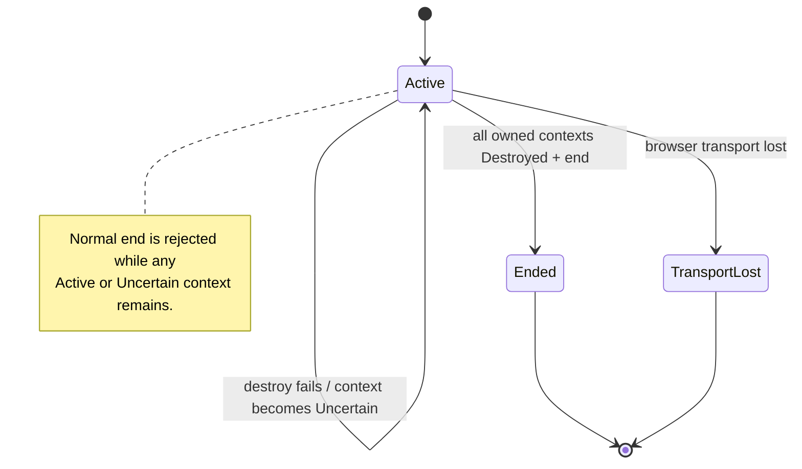

# Browser Session lifecycle authority

This diagram describes the active-PR domain contract introduced for issue #312. It is not evidence that a WebDriver BiDi or Chromium adapter already implements the port.

```mermaid
sequenceDiagram
    autonumber
    participant C as Application service
    participant S as BrowserSession aggregate
    participant P as DisposableContextPort
    participant B as Browser adapter (planned)

    C->>S: start(valid BrowserSessionId)
    C->>S: create_disposable_context(port)
    S->>S: reserve monotonic context epoch
    S->>P: create_disposable_context(session_id)
    P->>B: create fresh isolation boundary + browsing context
    B-->>P: unique isolation id + BrowsingContextId
    P-->>S: DisposableContextHandle
    S->>S: register exact isolation handle + Active epoch
    S-->>C: PresentationMutationAuthority(session, isolation, context, epoch)

    Note over C,S: Raw BrowserSessionId/BrowsingContextId cannot mint authority.

    C->>S: advance_context_epoch(context_id)
    S->>S: replace epoch; old authority becomes stale
    S-->>C: new opaque authority carrying same isolation

    C->>S: destroy_disposable_context(authority, port)
    S->>S: validate exact session/isolation/context/epoch before I/O
    S->>P: destroy_disposable_context(session_id, stored handle)
    P->>B: remove exact owned isolation boundary
    B-->>P: observed destruction post-condition
    P-->>S: success
    S->>S: context = Destroyed
    C->>S: end()
    S->>S: require every owned context Destroyed
    S-->>C: Ended
```

Two aggregates may receive the same external `BrowserSessionId`, the same `BrowsingContextId`, and the same local epoch. Their authority must still differ because the adapter-created disposable isolation identity is non-aliasing for its live lifetime. Passing aggregate A's authority into aggregate B therefore fails before adapter I/O; aggregate B's own destroy call carries B's stored isolation handle instead of reconstructing cleanup authority from the shared transport identifiers.

For a WebDriver BiDi adapter, the isolation identity is expected to map one-to-one to the specification-defined unique user-context id created by `browser.createUserContext`, and cleanup targets that exact user context. The protocol id remains lifecycle addressability, not OriginWeave policy authority.

## Failure state machine



`TransportLost` is terminal for this aggregate. Recovery of an uncertain remote browser boundary requires a separate reconciliation design; reopening the same aggregate would allow stale authority to regain meaning and is therefore not part of this slice.
