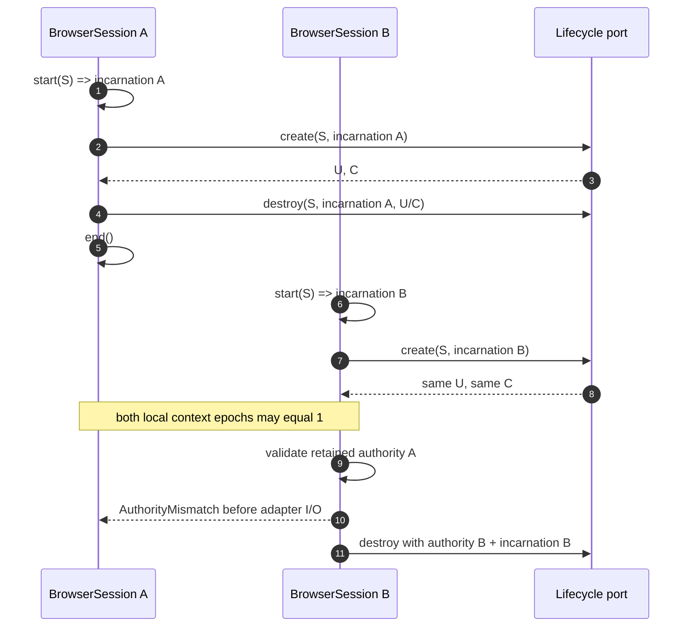

# Browser Session lifecycle authority

This diagram describes the active-PR domain contract for issue #312. It is not evidence that a WebDriver BiDi or Chromium adapter already implements the port.

```mermaid
sequenceDiagram
    autonumber
    participant C as Application service
    participant S as BrowserSession aggregate
    participant P as DisposableContextPort
    participant B as Browser adapter (planned)

    C->>S: start(valid BrowserSessionId)
    S->>S: allocate BrowserSessionIncarnation
    C->>S: create_disposable_context(port)
    S->>S: reserve monotonic context epoch
    S->>P: create_disposable_context(session_id, incarnation)
    P->>B: create fresh isolation boundary + browsing context
    B-->>P: unique isolation id + BrowsingContextId or typed create error
    P-->>S: DisposableContextHandle
    S->>S: register exact handle + Active epoch
    S-->>C: PresentationMutationAuthority(session, incarnation, isolation, context, epoch)

    Note over C,S: Raw BrowserSessionId/BrowsingContextId/user-context id cannot mint authority.

    C->>S: advance_context_epoch(context_id)
    S->>S: replace epoch; old authority becomes stale
    S-->>C: new opaque authority carrying same incarnation + isolation

    C->>S: destroy_disposable_context(authority, port)
    S->>S: validate exact session/incarnation/isolation/context/epoch before I/O
    S->>P: destroy_disposable_context(session_id, incarnation, stored handle)
    P->>B: remove exact owned isolation boundary
    B-->>P: observed destruction post-condition or DisposableContextDestroyError
    P-->>S: success
    S->>S: context = Destroyed
    C->>S: end()
    S->>S: require every owned context Destroyed
    S-->>C: Ended
```

`BrowserSessionIncarnation` separates two sequential aggregate lifecycles even when the browser or adapter later reuses the same external session, user-context/isolation, browsing-context, and local epoch values. The incarnation is checked by authority validation and reaches the lifecycle port. It is therefore not merely an aggregate-local nonce that the adapter can ignore.

For a WebDriver BiDi adapter, `DisposableIsolationId` maps to the user-context id created by `browser.createUserContext`. That protocol id remains lifecycle addressability rather than OriginWeave policy authority. Creation and destruction expose distinct typed errors.

## Recovery and transport state

```mermaid
stateDiagram-v2
    [*] --> Active
    Active --> Active: fresh isolation + context / authority minted
    Active --> Active: context epoch advanced / prior authority stale
    Active --> Active: exact owned isolation destruction proved
    Active --> Active: DisposableContextCreateError::CreateFailedClean
    Active --> RecoveryRequired: CreateFailedUncertain / retain known partial isolation
    Active --> RecoveryRequired: duplicate output / retain offending handle
    Active --> RecoveryRequired: DisposableContextDestroyError / cleanup unproven
    Active --> Ended: all owned contexts Destroyed + end
    Active --> TransportLost: browser transport lost
    RecoveryRequired --> RecoveryRequired: transport_lost = true / preserve recovery evidence
    Ended --> [*]
    RecoveryRequired --> [*]
    TransportLost --> [*]

    note right of RecoveryRequired
      BrowserSessionRecoveryEvidence retains known
      partial identity, duplicate handle, or exact
      unproven-destruction handle. It grants no I/O.
    end note

    note right of TransportLost
      Transport liveness is orthogonal to ownership
      recovery. Duplicate loss reports are idempotent.
    end note
```

## Sequential ABA hostile case



`RecoveryRequired` and `TransportLost` remain terminal for normal authority in this slice. A later reconciliation design may inspect `BrowserSessionRecoveryEvidence`, but it must not reconstruct cleanup authority from raw identifiers or treat command ACK as proof of destruction.
