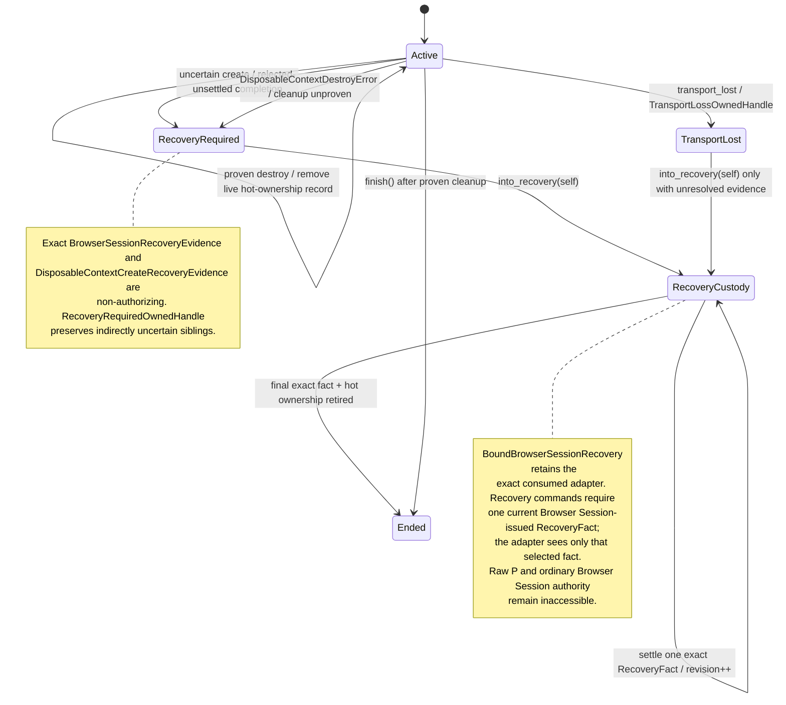
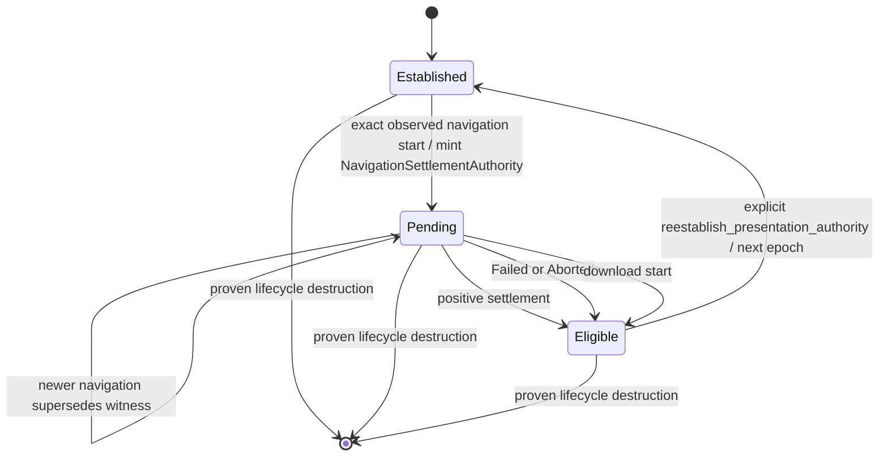

# Browser Session lifecycle authority

This diagram describes the active-PR domain contract for issue #312. It is not evidence that a WebDriver BiDi or Chromium adapter already implements the port.

## Ordinary lifecycle and presentation authority

```mermaid
sequenceDiagram
    autonumber
    participant C as Application service
    participant S as BrowserSession aggregate
    participant BS as BoundBrowserSession
    participant P as DisposableContextPort / AuthorizedContextOperationPort
    participant B as Browser adapter (planned)

    C->>S: start(valid BrowserSessionId)
    S->>S: allocate BrowserSessionIncarnation
    C->>S: bind_lifecycle_port(port by value)
    S-->>C: BoundBrowserSession owns aggregate + exact port
    Note over S,P: binding invokes no adapter callback; no public raw port accessor

    C->>BS: create_disposable_context()
    BS->>S: require Active + reserve monotonic BrowserContextEpoch
    S->>S: mint DisposableContextCreateRequest(session, incarnation, attempt epoch)
    S->>P: create_disposable_context(request)
    P->>B: create/stage isolation boundary + browsing context
    B-->>P: DisposableContextHandle or typed create error
    P-->>S: candidate remains pending/non-authorizing

    alt domain handle accepted
        S->>S: validate no isolation/context alias
        S->>S: mint DisposableContextCreateCompletion(Accepted, exact attempt)
        S->>P: complete_disposable_context_creation(completion)
        P->>P: pending exact attempt → accepted
        S->>S: register exact handle + Active epoch
        S-->>C: PresentationMutationAuthority(session, incarnation, isolation, context, epoch)
    else domain handle rejected/unsettled
        S->>S: retain exact non-authorizing recovery evidence
        S->>S: retain Active siblings as RecoveryRequiredOwnedHandle
        S->>P: DisposableContextCreateCompletion(Rejected, exact attempt)
        S->>S: RecoveryRequired
    end

    C->>BS: execute_authorized_context_operation(authority, operation)
    BS->>S: validate session/incarnation/isolation/context/epoch
    alt authority current
        BS->>BS: mint private AuthorizedContextOperationRequest
        BS->>P: execute_authorized_context_operation(request)
        P->>B: adapter-owned presentation command
        B-->>P: typed result
        P-->>C: output or adapter error
    else stale or foreign authority
        S-->>C: AuthorizedContextOperationError::BrowserSession
        Note over BS,P: adapter I/O = 0
    end

    C->>BS: destroy_disposable_context(authority)
    BS->>S: validate exact authority before I/O
    S->>P: DisposableContextDestroyRequest(handle, validated epoch)
    P->>B: remove exact owned isolation boundary
    alt destruction proved
        P-->>S: success
        S->>S: remove live hot-ownership record
    else DisposableContextDestroyError / cleanup unproven
        S->>S: keep record Uncertain
        S->>S: retain exact UnprovenDestruction(handle, epoch)
        S->>S: RecoveryRequired
    end

    C->>BS: finish()
    alt no live or uncertain ownership remains
        BS->>S: end()
        S-->>C: Ended
    else ownership remains
        S-->>C: ActiveContextRemains
        Note over C,P: same BoundBrowserSession + exact adapter retained for cleanup/retry
    end
```

`BoundBrowserSession` is a linear lifecycle-port binding. It consumes one concrete port, exposes no public raw `&P`, and accepts no replacement port on lifecycle methods. `AuthorizedContextOperationRequest` is privately constructed after exact `PresentationMutationAuthority` validation. A raw browser id, adapter-selected value, diagnostic view, or second adapter cannot mint Browser Session authority.

## Recovery custody and exact same-adapter recovery



```mermaid
sequenceDiagram
    autonumber
    participant C as Recovery owner / application service
    participant R as BoundBrowserSessionRecovery
    participant BS as retained BoundBrowserSession
    participant P as exact consumed adapter
    participant B as Browser / protocol endpoint

    C->>BS: unresolved destroy or transport loss
    BS->>BS: RecoveryRequired or TransportLost + exact evidence
    C->>BS: into_recovery(self)
    BS-->>R: move exact BoundBrowserSession + same adapter; no I/O

    C->>R: recovery_fact(index) or create_attempt_recovery_fact(index)
    R-->>C: opaque RecoveryFact(session, incarnation, ledger, index, revision)
    C->>R: execute_recovery_context_operation(fact, operation)
    R->>R: validate state + session/incarnation + revision + exact current fact
    alt fact foreign, stale, or no longer current
        R-->>C: AuthorityMismatch or StaleFact
        Note over R,P: adapter I/O = 0
    else current exact fact
        R->>BS: crate-private dispatch_recovery_operation
        BS->>P: RecoveryContextOperationRequest(selected fact + operation)
        Note over P: sibling recovery facts are not disclosed
        P->>B: adapter-owned purpose-bounded recovery command
        B-->>P: result
        P-->>R: Output or RecoveryContextOperationError::Adapter
        Note over R,BS: success/failure does not clear Browser Session uncertainty
    end

    C->>R: settle_recovery_fact(fact, independently qualified proof)
    R->>R: revalidate session/incarnation/revision/exact fact
    R->>BS: crate-private dispatch_recovery_operation
    BS->>P: RecoverySettlementRequest(selected fact + proof)
    P->>B: verify protocol-specific proof / post-condition evidence
    alt proof rejected
        P-->>R: RecoverySettlementError::Adapter
        Note over R,BS: no domain fact is retired
    else proof accepted
        R->>BS: retire exactly selected fact
        R->>R: recovery revision++
        Note over R: every previously issued RecoveryFact becomes stale
        alt no recovery facts or uncertain hot ownership remain
            R->>BS: terminal Ended
        end
    end

    Note over R,P: no raw P, no generic caller callback, no ordinary create/destroy/presentation authority
```

Recovery custody is narrower than protocol reconciliation. #316 remains responsible for WebDriver BiDi pending/accepted/quarantined tuple truth, remote liveness, event correlation, replay qualification, and concrete recovery-command/proof semantics. `RecoveryContextOperationPort` provides the same-consumed-adapter conduit only for one current `RecoveryFact`; adapter success is not destruction proof. `RecoverySettlementPort` independently qualifies proof before Browser Session retires that exact fact.

Dropping unresolved ordinary or recovery custody performs no browser I/O. `abandoned_bound_session_count()` is a process-local operability signal, not durable exact-handle storage or proof of cleanup.

## Navigation / presentation interaction



Navigation admission is bound to exact `BrowserSessionIncarnation`, `BrowsingContextId`, and current `BrowserContextEpoch`. The opaque navigation witness, not raw WebDriver BiDi navigation ids, controls terminal assignment. A navigation-invalidated `PresentationMutationAuthority` cannot authorize presentation mutation or authority-based cleanup. The exact bound lifecycle owner can still destroy its owned context without reopening presentation authority.

## Same-raw-identity and sequential ABA hostile cases

A single aggregate may create → prove destroy → recreate the same raw isolation/browsing-context values for **258 ownership generations**. Hot command-authority state remains bounded to live/uncertain ownership. The predecessor authority fails as `ContextNotOwned` immediately after destruction and as `AuthorityMismatch` after same-raw-id recreation because the epoch is monotonic.

Across aggregate restart/recreation, `BrowserSessionIncarnation` prevents a retained authority from aggregate A from becoming valid in aggregate B even when raw `BrowserSessionId`, isolation, browsing-context id, and local epoch numerically alias.

`RecoveryRequired` and `TransportLost` remain closed to ordinary lifecycle and presentation authority. `into_recovery(self)` is a one-way custody transfer, not command-authority resurrection. A recovery command additionally requires a current opaque `RecoveryFact`; command ACK never settles that fact. Proof-bearing settlement can only retire the selected fact after independent adapter verification, and complete settlement reaches terminal `Ended` rather than reopening ordinary authority.
