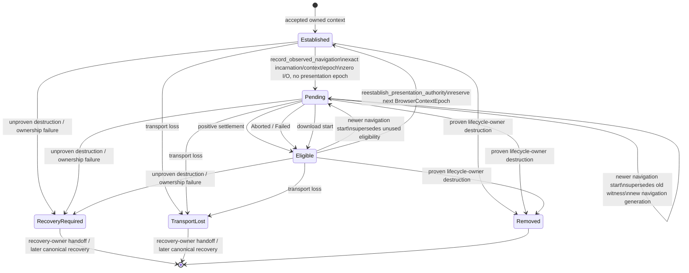

# Browser Session navigation authority UML

Status: `IMPLEMENTED_ON_ACTIVE_PR` on #317. This diagram describes Browser Session domain state, not WebDriver BiDi adapter tuple state.



The `Pending` state is qualified by a private monotonic `navigation_generation` and a `committed` bit. `Eligible` is context-local and represents exactly one unused opportunity to re-establish presentation authority. Neither commit nor terminal closure advances `BrowserContextEpoch`; only successful explicit re-establishment does.

```mermaid
sequenceDiagram
    participant BiDi as #316 BiDi adapter
    participant Session as BoundBrowserSession
    participant Aggregate as BrowserSession
    participant Port as Same consumed adapter

    BiDi->>Session: qualified navigationStarted(incarnation, context, epoch)
    Session->>Aggregate: begin_observed_navigation(...)
    Aggregate-->>Session: opaque NavigationSettlementAuthority
    Note over Session,Aggregate: presentation authority revoked; zero adapter I/O

    BiDi->>Session: qualified navigationCommitted(witness)
    Session->>Aggregate: mark_observed_navigation_committed(witness)
    Aggregate-->>Session: commit progress only

    BiDi->>Session: complete | abort | fail | download(witness)
    Session->>Aggregate: close_observed_navigation(witness)
    Aggregate-->>Session: Eligible

    BiDi->>Session: reestablish_presentation_authority(witness)
    Session->>Aggregate: validate current Eligible witness
    Aggregate-->>Session: new PresentationMutationAuthority(next epoch)

    alt lifecycle cleanup is required while presentation is revoked
        BiDi->>Session: destroy_owned_disposable_context(context)
        Session->>Aggregate: validate exact lifecycle custody
        Aggregate->>Port: opaque DisposableContextDestroyRequest(handle, epoch)
        Port-->>Aggregate: destruction result
        Aggregate-->>Session: remove exact owned generation or enter RecoveryRequired
    end
```

## Capability boundary

- `NavigationSettlementAuthority` is opaque and caller-unconstructible; raw BiDi navigation/context identifiers are evidence only.
- `PresentationMutationAuthority` becomes stale immediately when a qualified navigation is admitted.
- A stale presentation capability cannot be reused for mutation or authority-based cleanup.
- `destroy_owned_disposable_context` is a lifecycle-owner path, not a presentation-authority bypass. It acts only on the exact current owned generation through the already-consumed adapter.
- `RecoveryRequired`, `TransportLost`, ended sessions, destroyed generations, foreign incarnations, stale epochs, and superseded navigation generations fail closed before browser I/O.
- #316 owns protocol event qualification, correlation, replay handling, transport loss, and remote-liveness interpretation. It must not duplicate this Browser Session state machine.

## Acceptance boundary

#318 and #321 exercise the wider hostile matrix—cross-context/cross-incarnation replay, supersession, terminal single assignment, download ordering, sibling destruction, same-raw-id recreation, and cumulative stale-capability rejection. They are acceptance successors, not alternate production owners.

Real Chromium success additionally requires browser-observed post-conditions and cleanup evidence. A command ACK alone does not transition this UML to buyer-visible GREEN.
