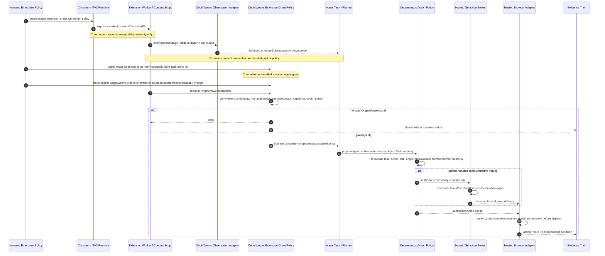
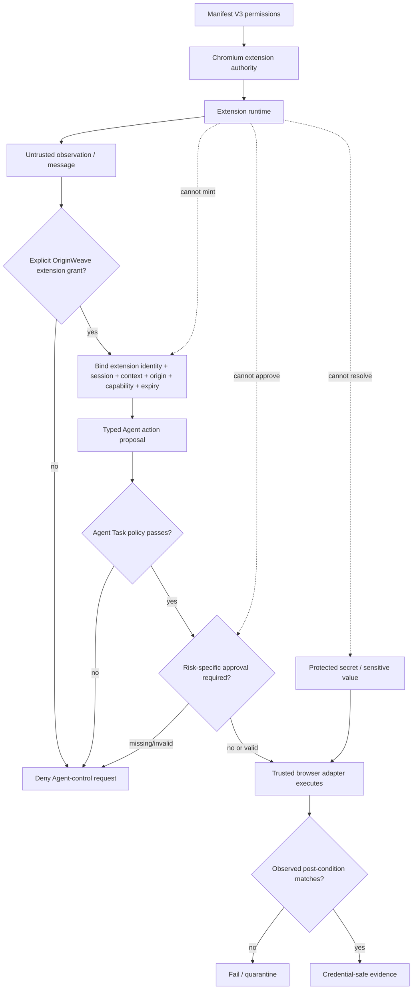
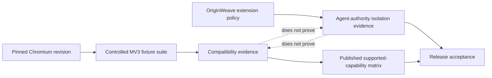

# Extension Compatibility and Agent Authority UML

- **Status:** Protected-main architecture visualization with active compatibility work
- **Scope:** Chromium Manifest V3 compatibility plane versus OriginWeave Agent authority
- **Related:** [`README.md`](README.md), [`../PRD.md`](../PRD.md), [`../TRD.md`](../TRD.md), [`../THREAT_MODEL.md`](../THREAT_MODEL.md), issue #27

This diagram makes one security invariant visually explicit:

> **A Chromium extension permission is not an OriginWeave Agent capability.**

A compatible extension can use the Chromium APIs granted by its manifest and managed browser policy. It cannot thereby grant itself OriginWeave task authority, widen an Agent Task origin, resolve a protected secret, approve a high-risk action, or turn extension/page content into a trusted instruction.

## Authority sequence

## Security state flow

## Compatibility evidence is separate from authority evidence

The release claim requires both evidence classes. A passing `downloads`, `bookmarks`, `history`, storage, service-worker, DNR, or content-script compatibility test does not prove extension isolation. Conversely, a correct Rust extension-grant kernel does not prove that a real Chromium extension API works.

## Maturity discipline

Protected main already contains extension-to-Agent authority foundations and pinned-Chromium MV3 compatibility evidence for several surfaces. Issue #27 remains open because the complete declared capability matrix, remaining compatibility surfaces, managed/native-messaging boundaries and release integration are not yet complete. This diagram therefore represents a mixture of implemented foundations and accepted/planned product flow; it must not be read as a claim of full Chrome extension compatibility.
